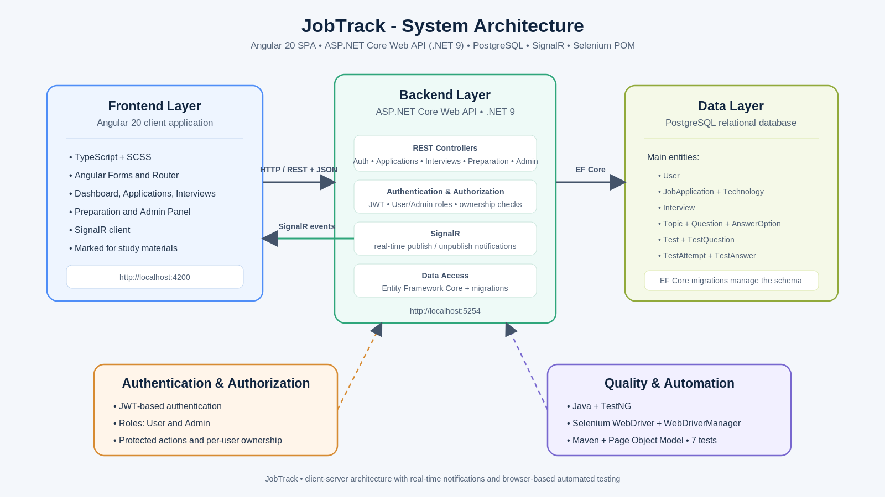

# JobTrack

JobTrack je web aplikacija za praćenje prijava za posao i pripremu za tehničke intervjue.

Aplikacija omogućava korisniku da na jednom mestu vodi evidenciju o prijavama i intervjuima, prati status procesa selekcije, priprema se kroz materijale i testove po tehnologijama i prati svoj napredak. Sistem ima i administratorski deo za upravljanje sadržajem za pripremu.

## Sadržaj

- [Funkcionalni pregled](#funkcionalni-pregled)
- [Arhitektura](#arhitektura)
- [Tehnološki stack](#tehnološki-stack)
- [Struktura repozitorijuma](#struktura-repozitorijuma)
- [Uloge i autorizacija](#uloge-i-autorizacija)
- [Baza podataka](#baza-podataka)
- [Lokalno pokretanje](#lokalno-pokretanje)
- [Konfiguracija](#konfiguracija)
- [Postavljanje u radno okruženje](#postavljanje-u-radno-okruženje)
- [Real-time obaveštenja](#real-time-obaveštenja)
- [Testiranje](#testiranje)
- [Troubleshooting](#troubleshooting)
- [Status projekta](#status-projekta)
- [Autor](#autor)

## Funkcionalni pregled

### Korisnički deo

JobTrack korisniku omogućava:

- registraciju i prijavu
- pregled dashboard-a sa osnovnim statistikama
- dodavanje, izmenu i brisanje prijava za posao
- praćenje statusa prijave:
  - Saved
  - Applied
  - HR Interview
  - Technical Interview
  - Offer
  - Rejected
  - No Response
- povezivanje prijave sa jednom ili više tehnologija
- pretragu i filtriranje prijava po kompaniji, poziciji, statusu i tehnologiji
- evidentiranje intervjua
- praćenje datuma, tipa, kontakta i ishoda intervjua
- pregled materijala za pripremu po tehnologijama i temama
- rešavanje testova
- automatsko računanje rezultata testa
- praćenje napretka po tehnologijama
- prikaz Job Readiness vrednosti na osnovu tehnologija vezanih za prijave
- pregled prethodnih rezultata testova
- real-time obaveštenje kada administrator objavi novi test

### Administratorski deo

Administrator može da upravlja sadržajem koji se koristi za pripremu:

- tehnologijama
- temama
- materijalima za učenje
- pitanjima i ponuđenim odgovorima
- testovima
- objavljivanjem i povlačenjem testova

Kada administrator objavi ili povuče test, promena se prosleđuje povezanim korisnicima preko SignalR-a.

## Arhitektura



JobTrack koristi klijent-server arhitekturu.

Angular aplikacija predstavlja frontend sloj i komunicira sa ASP.NET Core Web API backend-om preko HTTP/REST zahteva. Backend sadrži poslovnu logiku, autentifikaciju, autorizaciju i pristup podacima. Entity Framework Core se koristi za komunikaciju sa PostgreSQL bazom i za migracije.

SignalR omogućava real-time komunikaciju između backend-a i povezanih Angular klijenata, dok Selenium Page Object Model testovi proveravaju odabrane korisničke tokove kroz pravi browser.

## Tehnološki stack

### Frontend

- Angular 20
- TypeScript
- SCSS
- Angular Forms
- Angular Router
- SignalR client
- Marked za prikaz Markdown materijala

### Backend

- ASP.NET Core Web API
- .NET 9
- Entity Framework Core
- PostgreSQL
- Npgsql
- JWT autentifikacija i autorizacija
- SignalR

### Test automation

- Java
- Maven
- Selenium WebDriver
- TestNG
- WebDriverManager
- Page Object Model

## Struktura repozitorijuma

```text
JobTrack/
  README.md
  .gitignore

  client/
    src/
      app/
    package.json
    angular.json

  server/
    JobTrack.Api/
      Controllers/
      Data/
      Models/
      Services/
      Migrations/
    JobTrack.sln

  page-object-model/
    pom.xml
    testng.xml
    src/
      main/java/pmf/imi/moodle/
        BasePageModel.java
        LoginPage.java
        ApplicationsPage.java
      test/java/pmf/imi/moodle/
        LoginPageTest.java
        ApplicationsPageTest.java

  docs/
    architecture/
      jobtrack-architecture.svg
    ...
```

## Uloge i autorizacija

Sistem koristi dve uloge:

- `User`
- `Admin`

`User` koristi funkcionalnosti vezane za svoje prijave, intervjue, pripremu i rezultate.

`Admin` ima pristup administratorskom panelu i upravlja tehnologijama, temama, pitanjima i testovima.

Autentifikacija je zasnovana na JWT tokenima. Backend proverava identitet i ulogu korisnika pre pristupa zaštićenim funkcionalnostima.

Korisnik može da pristupa i menja samo podatke koji pripadaju njegovom nalogu, kao što su njegove prijave, intervjui i rezultati testova.

## Baza podataka

Aplikacija koristi PostgreSQL bazu podataka.

Glavne grupe podataka su:

- korisnici
- prijave za posao
- tehnologije
- veze prijava i tehnologija
- intervjui
- teme
- pitanja
- ponuđeni odgovori
- testovi
- pitanja testova
- pokušaji rešavanja testova
- odgovori korisnika

Entity Framework Core se koristi za mapiranje modela i rad sa bazom.

Migracije se nalaze u backend projektu i koriste se za kreiranje i ažuriranje šeme baze.

## Lokalno pokretanje

### Preduslovi

Za pokretanje projekta potrebno je imati:

- .NET 9 SDK
- Node.js i npm
- Angular CLI
- PostgreSQL
- JDK 17 ili noviji za Selenium testove
- Google Chrome
- Maven ili IntelliJ IDEA sa Maven podrškom

### 1. PostgreSQL

Potrebno je kreirati lokalnu PostgreSQL bazu.

Razvojna baza korišćena u projektu:

```text
jobtrack_db
```

### 2. Backend

Otvoriti:

```bash
cd server/JobTrack.Api
```

Lokalni osetljivi podaci čuvaju se pomoću .NET User Secrets.

Primer connection string-a:

```bash
dotnet user-secrets set "ConnectionStrings:DefaultConnection" "Host=localhost;Port=5433;Database=jobtrack_db;Username=postgres;Password=YOUR_PASSWORD"
```

JWT ključ:

```bash
dotnet user-secrets set "Jwt:Key" "YOUR_SECRET_JWT_KEY"
```

Primena migracija:

```bash
dotnet ef database update
```

Pokretanje backend-a:

```bash
dotnet run
```

Backend se lokalno pokreće na:

```text
http://localhost:5254
```

Swagger je dostupan na:

```text
http://localhost:5254/swagger
```

### 3. Frontend

Otvoriti novi terminal:

```bash
cd client
```

Instalirati zavisnosti:

```bash
npm install
```

Pokrenuti aplikaciju:

```bash
ng serve
```

Frontend je dostupan na:

```text
http://localhost:4200
```

## Konfiguracija

Osetljiva lokalna konfiguracija se ne čuva u repozitorijumu.

Za razvojno okruženje koriste se .NET User Secrets za:

- PostgreSQL connection string
- JWT signing key

Na ovaj način lozinka baze i JWT ključ nisu deo `appsettings.json` fajla koji se objavljuje u repozitorijumu.

Frontend u lokalnom okruženju komunicira sa API-jem na:

```text
http://localhost:5254
```

Backend prihvata zahteve Angular aplikacije koja se lokalno pokreće na:

```text
http://localhost:4200
```

## Postavljanje u radno okruženje

Aplikacija se trenutno demonstrira u lokalnom razvojnom okruženju.

Postupak prebacivanja u produkciono radno okruženje obuhvata sledeće korake:

1. Obezbediti PostgreSQL bazu dostupnu backend serveru.
2. Podesiti produkcioni connection string i JWT ključ kao server secrets ili environment promenljive.
3. Primeniti Entity Framework Core migracije nad produkcionom bazom.
4. Build-ovati i postaviti ASP.NET Core Web API na server sa podrškom za .NET 9.
5. Build-ovati Angular aplikaciju produkcionom komandom.
6. Postaviti generisane Angular statičke fajlove na odgovarajući web server ili frontend hosting.
7. Zameniti lokalne API adrese produkcionim adresama.
8. Podesiti CORS tako da backend prihvata zahteve sa produkcionog frontend domena.
9. Obezbediti HTTPS komunikaciju.
10. Omogućiti WebSocket konekcije koje SignalR koristi za real-time komunikaciju.
11. Nakon postavljanja proveriti autentifikaciju, rad sa prijavama, intervjuima, testovima, administratorski deo i SignalR obaveštenja.

Produkcione tajne ne treba čuvati u izvornom kodu niti u javnom repozitorijumu.

## Real-time obaveštenja

JobTrack koristi SignalR za komunikaciju u realnom vremenu.

Osnovni tok pri objavljivanju testa:

1. Administrator objavljuje test.
2. Backend čuva promenu.
3. SignalR hub šalje događaj trenutno povezanim klijentima.
4. Korisnik odmah dobija obaveštenje bez osvežavanja stranice.
5. Ako je korisnik već na Preparation stranici, lista dostupnih testova se osvežava.
6. Korisnik preko obaveštenja može da ode do odgovarajućeg dela za pripremu.

Sličan tok se koristi kada administrator povuče prethodno objavljeni test.

## Testiranje

Automatizovano UI testiranje realizovano je korišćenjem Selenium WebDriver-a u Javi, TestNG-a i Page Object Model obrasca.

Lokacija:

```text
page-object-model/
```

### Struktura

Page Object klase:

```text
src/main/java/pmf/imi/moodle/
```

Test klase:

```text
src/test/java/pmf/imi/moodle/
```

Test suite:

```text
testng.xml
```

Zajednička bazna klasa:

```text
BasePageModel.java
```

### Pokretanje

Pre testiranja moraju biti pokrenuti backend i frontend.

Ako je Maven dostupan iz terminala:

```bash
cd page-object-model
mvn clean test
```

Testovi se mogu pokrenuti i iz IntelliJ IDEA preko Maven `test` lifecycle komande.

### Trenutni test suite

Suite trenutno sadrži 7 testova.

`LoginPageTest` proverava:

- otvaranje login stranice i URL
- prikaz greške za neispravne kredencijale
- uspešnu prijavu

`ApplicationsPageTest` proverava:

- otvaranje Job Applications stranice
- otvaranje forme za novu prijavu
- dostupne opcije status filtera
- unos teksta u search polje

Poslednje pokretanje suite-a:

```text
Tests run: 7
Failures: 0
Errors: 0
Skipped: 0
BUILD SUCCESS
```

Page Object Model odvaja lokatore i operacije nad stranicama od samih test scenarija, pa test klase ostaju preglednije i jednostavnije za održavanje.

## Troubleshooting

### Backend ne može da se poveže sa bazom

Proveriti:

- da PostgreSQL servis radi
- da baza `jobtrack_db` postoji
- port PostgreSQL servera
- vrednost `ConnectionStrings:DefaultConnection` u User Secrets

### Frontend ne dobija podatke

Proveriti:

- da backend radi na `http://localhost:5254`
- da frontend koristi odgovarajuću API adresu
- CORS konfiguraciju backend-a

### Login ne radi

Proveriti:

- da backend i baza rade
- da korisnički nalog postoji
- da JWT konfiguracija postoji u User Secrets

### SignalR obaveštenje se ne pojavljuje

Proveriti:

- da su backend i frontend pokrenuti
- da je korisnik prijavljen
- da SignalR konekcija može da se uspostavi
- da test zaista menja publish/unpublish stanje

### Selenium testovi ne mogu da se pokrenu

Proveriti:

- da Chrome postoji
- da backend radi
- da frontend radi na `http://localhost:4200`
- da postoji test korisnik koji test koristi
- da su Maven zavisnosti učitane

## Status projekta

JobTrack trenutno pokriva glavne planirane funkcionalnosti:

- autentifikaciju i autorizaciju
- praćenje prijava za posao
- praćenje intervjua
- materijale i testove za tehničku pripremu
- rezultate i napredak
- Job Readiness prikaz
- administratorsko upravljanje sadržajem
- SignalR real-time obaveštenja
- Selenium Page Object Model automatizovane testove

Projekat je spreman za lokalnu demonstraciju funkcionalnosti i automatizovano testiranje.

## Autor

**Jovana Šajkić 95/2022**  
Prirodno-matematički fakultet, Univerzitet u Kragujevcu  
Institut za matematiku i informatiku
